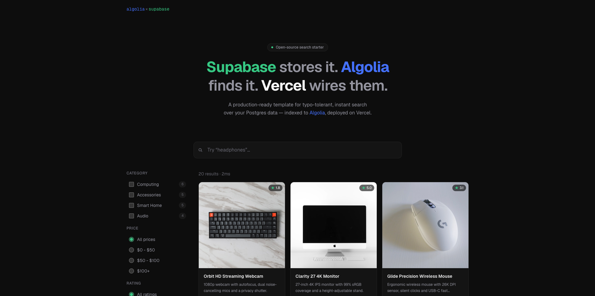

# Algolia × Supabase Starter

A minimal [Next.js](https://nextjs.org) starter for instant, typo-tolerant search
over Postgres data. [Supabase](https://supabase.com) stores the products,
[Algolia](https://www.algolia.com) indexes and searches them, and the
[Algolia connector](https://www.algolia.com/doc/tools/connectors/postgresql/) keeps
the index in sync — no sync code in the app. Deploy it, seed the database, connect
the two from their dashboards, and search is live.

<!-- TODO: capture docs/screenshot.png -->


<!-- TODO: publish the live demo -->
**Live demo:** [algolia-supabase-starter.vercel.app](https://algolia-supabase-starter.vercel.app)

## Deploy your own

The button installs both integrations on your new project — Supabase provisions a
Postgres database, Algolia provisions an application — and injects their environment
variables. No manual configuration.

<!-- TODO: confirm supabase slugs at integration install -->
[](https://vercel.com/new/clone?repository-url=https%3A%2F%2Fgithub.com%2FLorrisSaintGenez%2Falgolia-supabase-starter&project-name=algolia-supabase-starter&repository-name=algolia-supabase-starter&stores=%5B%7B%22type%22%3A%22integration%22%2C%22integrationSlug%22%3A%22algolia%22%2C%22productSlug%22%3A%22application%22%7D%2C%7B%22type%22%3A%22integration%22%2C%22integrationSlug%22%3A%22supabase%22%2C%22productSlug%22%3A%22supabase%22%7D%5D)

## Set up the database

Seed the sample products once from the Supabase dashboard:

1. Open your project → **SQL Editor** → **New query**.
2. Paste the contents of [`db/seed.sql`](db/seed.sql) and **Run**.
3. Confirm the final `select count(*)` returns `20`.

Re-running is safe — the seed upserts on `id`.

## Connect Algolia

Create the connector from the Algolia dashboard → **Data sources** → **Connectors** →
**PostgreSQL**:

1. **Source** — connect with the values from Supabase → **Project Settings** →
   **Database**. Use the **Session pooler** (port `5432`) host, database `postgres`,
   user, and password. Set the table to `products`.
2. **Key** — set the primary key to `id`.
3. **Transformation** — paste the code below so DB-only fields
   (`cost_price`, `supplier_id`, `internal_notes`, `stock_location`) never reach the
   index. Check the preview: those fields must be gone.

   ```js
   async function transform(record, helper) {
     return {
       objectID: String(record.id),
       name: record.name,
       description: record.description,
       category: record.category,
       price: Number(record.price),
       image_url: record.image_url ?? null,
       rating: record.rating == null ? null : Number(record.rating),
     };
   }
   ```

4. **Destination** — set the index name to `products`.
5. **Task** — run a full reindex. Add a schedule if you want recurring syncs.

Reload your deployment — search is live.

## Local development

```bash
git clone https://github.com/LorrisSaintGenez/algolia-supabase-starter && cd algolia-supabase-starter
npm install
npx vercel link              # link to the project you deployed
npx vercel env pull .env.local
npm run dev
```

Open [http://localhost:3000](http://localhost:3000).

## How it works

The integrations inject these environment variables. Only the two Algolia search
values are exposed to the browser — mapped in [`next.config.ts`](next.config.ts):

| Variable | Purpose | Browser-safe? |
| --- | --- | --- |
| `ALGOLIA_APP_ID` | Identifies your Algolia application | ✅ exposed as `NEXT_PUBLIC_ALGOLIA_APP_ID` |
| `ALGOLIA_SEARCH_API_KEY` | Search-only key used by the frontend | ✅ exposed as `NEXT_PUBLIC_ALGOLIA_SEARCH_API_KEY` |
| `POSTGRES_URL` | Supabase connection string for the product page | ❌ server-side only |
| `ALGOLIA_WRITE_API_KEY` | Indexing key | ❌ unused by the app; the connector indexes from the dashboard |

Key files:

- [`app/page.tsx`](app/page.tsx) — landing page rendering the search experience
- [`components/search/search-experience.tsx`](components/search/search-experience.tsx) — InstantSearch UI (`algoliasearch` lite client)
- [`app/products/[id]/page.tsx`](app/products/[id]/page.tsx) — product page served from Supabase, showing the DB-only fields
- [`db/seed.sql`](db/seed.sql) — schema + 20 sample products for the SQL Editor
- [`transformations/transform.js`](transformations/transform.js) — canonical copy of the connector transformation

## Going to production

- Add authentication before exposing any write path — this template is read-only.
- Enable incremental sync with a soft-delete column so removals propagate to the index.
- Trigger the connector task from the [Ingestion API](https://www.algolia.com/doc/rest-api/ingestion/)
  as a server-side extension instead of the dashboard schedule.

## License

[MIT](LICENSE)
